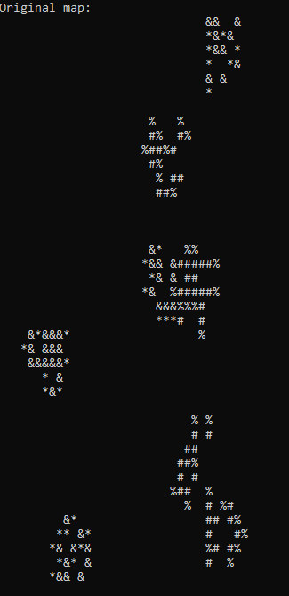
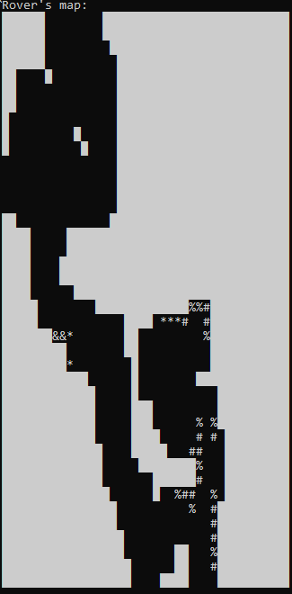

# Map Rover Exploration

This repository contains a C# Console Application that generates and explores maps using a simulated rover. The application generates a 2D map filled with various terrain features, including mountains, pits, minerals, and water. After the map is generated, a rover is placed on it to search for specific tasks.

## Features

- **Map Generation**: Generates a 2D map and populates it with various terrain features:
  - **Mountains** 
  - **Pits** 
  - **Minerals** 
  - **Water** 
  - **Free Space** 
- **Rover Exploration**: The rover explores the map to complete two main tasks:
  - **Task 1**: Find a given amount of minerals and water on the map.
  - **Task 2**: Identify a 3x3 habitable area where water, mineral, and free space are present.

## Simulation

The application tracks the simulation and displays information and the end results in the console.

Example of a generated map:



- **The symbols in this example are:**
  - **Mountain (#)** 
  - **Pits (&)**  
  - **Minerals (%)** 
  - **Water (*)** 


Example of a discovered map as the rover percieved it:



The white space represents the undiscovered piece of the map where the rover didn't explore during its mission.

## Usage
  **Feel free to experiment with using different simulation configurations in Programing.cs**

  There are parameters with comments to showcase what they modify and affect

## Prerequisites

Before you begin, make sure you have the following installed on your machine:

- [.NET Core SDK](https://dotnet.microsoft.com/download) (8.0 or later)

- ## Project Structure

```
root
│
├── Coodecool.MarsExploration/   # .NET Console Application
│   
└── MarsExplorationTest/         # Unit Tests
```

## How to Clone

```bash
git clone https://github.com/CodecoolGlobal/mars-exploration-1-csharp-Tommer-04.git
cd mars-exploration-1-csharp-Tommer-04
```

## Starting the application

# Navigate to the application fodler

From the root folder you can navigate to the application using this command:
\`\`\`bash
cd Coodecool.MarsExploration
\`\`\`

# How to Build
To build the project, use the following command in the root directory of the repository:

\`\`\`bash
dotnet build
\`\`\`

# How to Run

To run the application, use the following command:

\`\`\`bash
dotnet run
\`\`\`

## Contributions

This project was developed with contributions from the following individuals:

- **Tamás Tóth**: Lead developer of the application.
- **Martin Hám**: Assisted with developement and debugging the application.
- **Máté Horváth**: Conducted unit testing to ensure the stability of certain classes.

## Contact

For any questions or suggestions, please feel free to open an issue or contact the contributors.